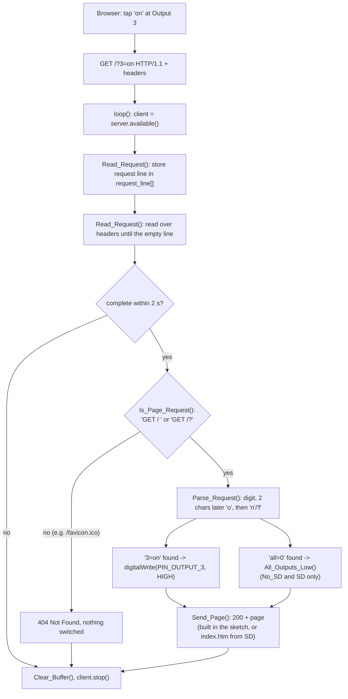

# Request flow

How a button press on the web page reaches an output pin. Example: the button
"on" of output 3 is the link `/?3=on`.

## Reading the request

`Read_Request()` is a small state machine with two states:

| State | What happens |
|---|---|
| `READ_LINE` | every byte except `\r` goes into `request_line[]` (at most 99 chars, the last place stays 0); `\n` switches to `SKIP_HEADERS` |
| `SKIP_HEADERS` | header lines are read and dropped; an empty line (`\r\n` right after `\r\n`) ends the request -> `true` |

It returns `false` if the client closes the connection first or if 2 s pass.
Only the request line is kept, so header text (for example a `Referer` that
contains `?3=on`) can never switch an output.

## The parser

The parser does no real URL parsing. It walks the request line and matches the
pattern directly: an output number followed two characters later by `'o'` and
then `'n'` (on) or `'f'` (off). `?3=on` contains `3=on`, `?3=off` contains
`3=of`. Several parameters in one request (`/?3=on&4=off`) are all applied.

`Webserver_No_SD` and `Webserver_SD` also look for the text `all=0`
(`/?all=0`) and then set every output LOW.

## The answer

| Request | Answer |
|---|---|
| `/` or `/?...` | `200 OK`, the page (`Webserver_SD`: `503` if the card or `index.htm` is missing) |
| anything else | `404 Not Found`, short text |

Every answer has `Connection: close`; the sketch closes the connection with
`client.stop()` after sending.
